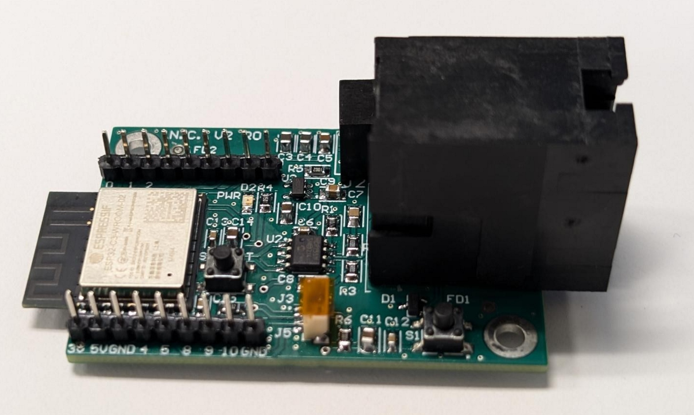
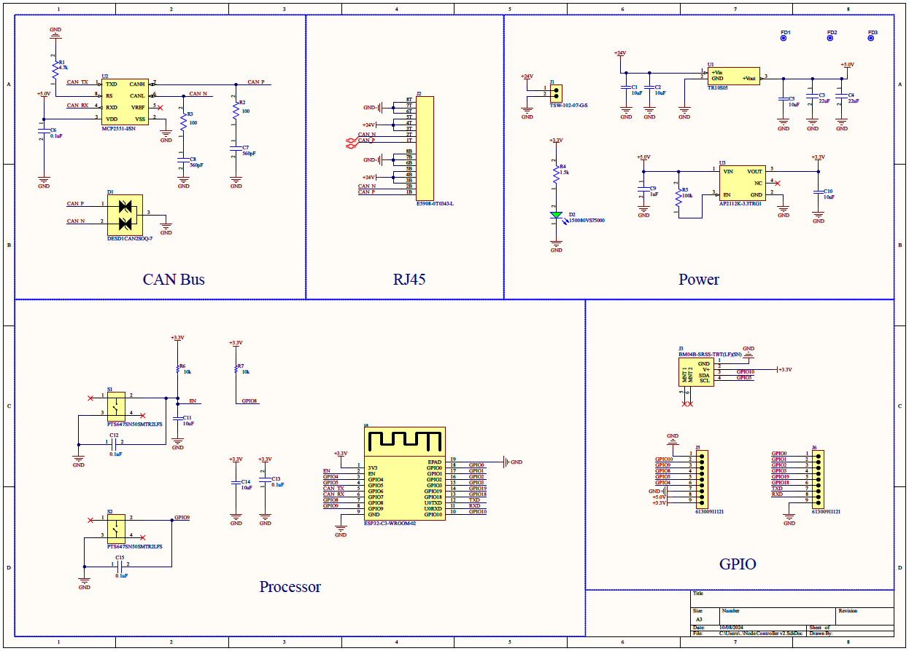

# Node Controller

The node controller acts the controller for each device in the network. This allows devices to operate independently from each other, meaning that a network can be made up of any combination of devices. The node controller has GPIO to interface with device peripherals and RJ45 plugs to interface with other devices and the base station via CAN Bus. The node controller is powered by 24V DC from the base station via the RJ45 plug.

Node Controller V1 is early prototype hardware and IS NOT compatible the current Node Controller V2

## Hardware

The node controller is powered by the ESP32 C3 WROOM 2 module. The Microchip MCP2551 is used for the CAN Bus interface.

## Firmware

See the [Node Controller Core](https://github.com/ProjectFishWorks/NodeControllerCore) repo for the library handeling the CAN Bus communications and the device-* repos for the device specific firmware using that library.